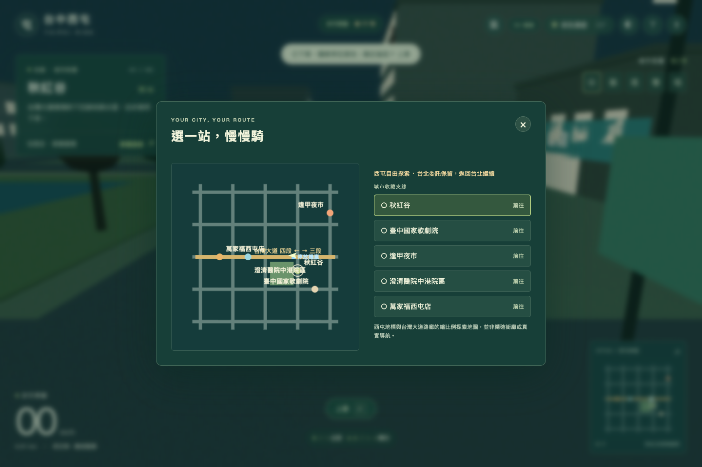
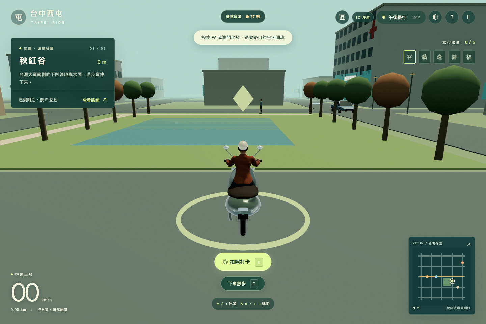
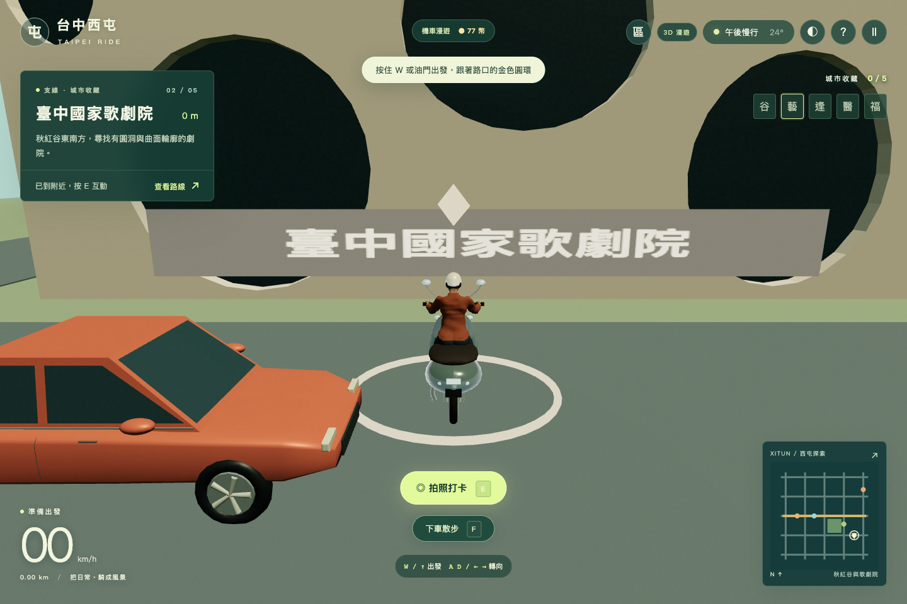
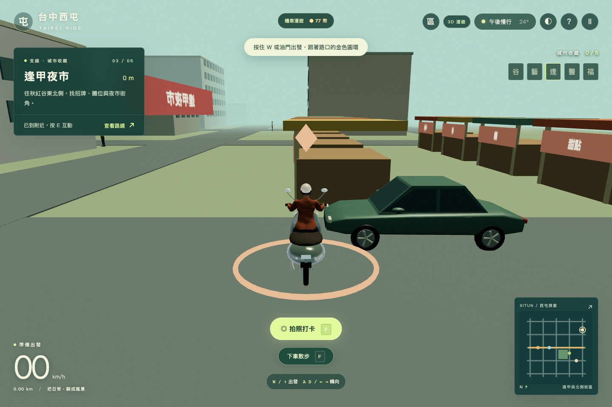
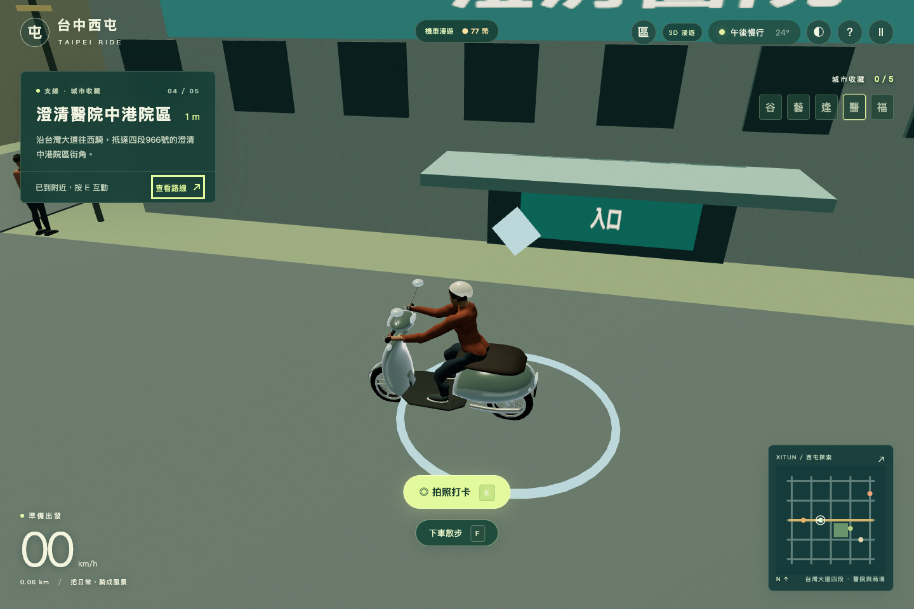
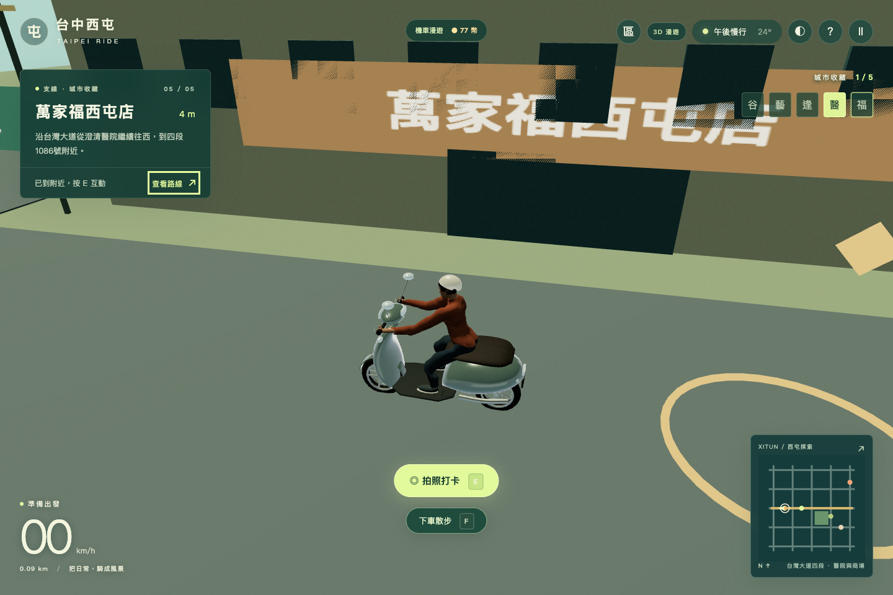

# 台北／西屯地區切換與台灣大道探索路廊

本次接續 `e5d5239b181fa95b2c78d10ba2eb4b8166743ffc` 的人物、機車與材質優化，增加按需載入的西屯探索地圖。台北保留原地標與送茶主線；西屯包含秋紅谷、臺中國家歌劇院、逢甲夜市、澄清醫院中港院區及萬家福西屯店五站。沒有合併 main 或部署。

## 如何遊玩

1. `npm ci`、`npm run dev`，開啟 `http://localhost:4173/?sample=refined` 使用優化後的人物與機車；一般網址也支援地區切換。
2. 開始旅程並結束或跳過到站片段，按右上角「區」，選「台中西屯 · 台灣大道」。
3. 從台灣大道入口朝西出發：沿同一條道路，先到澄清中港院區，再繼續到萬家福西屯店附近；道路與交通不中斷，沒有另外傳送到不連通的小場景。
4. 按 M 選任一地標、慢下來按 E 打卡；F 下車／上車；R 在目前地區安全入口重新停放人車。
5. 同樣按「區」返回台北，繼續原本委託及台北收藏。兩地印記各自保存；遊戲幣、夜色與累積里程共用。切換保留步行／騎乘模式，但從當地安全入口出發。
6. 可取消首次載入，網路載入失敗後可直接重試。`?renderer=2d` 提供相同路網與存檔的 Canvas 相容畫面。

這是縮比例探索街區，不是精確西屯街廓、完整行政區、實際交通規則或真實導航。台灣大道三／四段的斜向路廊在遊戲中被拉直並壓縮，支路以既有格網簡化；保留東西順序、主要地標南北方位及可連續行駛性。地標打卡環位於可停留的街角，不直接等同建築座標。醫院和商場只是外觀探索，未建立醫療或購物服務。

## 位置核對（2026-10-03）

| 地點 | 公開定位資料 | 本圖關係 |
| --- | --- | --- |
| 秋紅谷 | 臺中觀光旅遊網頁面 meta：24.16801, 120.63935 | 台灣大道路廊南側的綠地與水面 |
| 臺中國家歌劇院 | 臺中觀光旅遊網頁面 meta：24.16265, 120.64030 | 秋紅谷東南側 |
| 逢甲夜市 | 交通部觀光署：24.175736, 120.64539；文華路／逢甲路／福星路商圈 | 秋紅谷東北側 |
| 澄清醫院中港院區 | 疾管署院所資料：西屯區台灣大道四段966號；Waze：24.1828416, 120.6170174 | 秋紅谷西北側，台灣大道四段街區 |
| 萬家福西屯店 | 萬家福官方：西屯區台灣大道四段1086號；Waze：24.1843629, 120.6149393 | 醫院西北側，同一條台灣大道路廊往西可達 |

官方資料明確列出「萬家福西屯店」，因此使用者所述醫院附近的萬家福已可與此店核對，不是憑品牌名稱猜地址。

來源：

- [秋紅谷／臺中觀光旅遊網](https://travel.taichung.gov.tw/zh-tw/attractions/intro/818)、[臺中國家歌劇院](https://travel.taichung.gov.tw/zh-tw/attractions/intro/942)：座標讀取自官方 HTML 的 `place:location:latitude/longitude`，網頁文字解析器未顯示全部動態內容。
- [逢甲夜市／交通部觀光署](https://www.taiwan.net.tw/m1.aspx?id=9471&sNo=0001112)。
- [院所資料／疾管署](https://www.cdc.gov.tw/En/Category/Page/_XqK2nV3LI11BLNaXzox8g)。醫院首頁連到 `ck.ccgh.com.tw`，但該院區站對此讀取回傳403，未假稱成功取得其交通圖。
- [萬家福官方西屯店地址](https://www.uni-prosperity.com.tw/impact/)、[官方線上購物門市資料](https://online.uni-prosperity.com.tw/en/faq/)。
- [澄清中港／Waze 公開地圖](https://www.waze.com/live-map/directions/tw/taichung-city/cheng-ching-hospital-zhonggang-branch?to=place.ChIJVwBKGfwVaTQRXn-ec2jnNws)、[萬家福西屯店／Waze](https://www.waze.com/live-map/directions/tw/taichung-city/carrefour-xitun-store?to=place.ChIJ35f91hgVaTQRBCT9JTvnmt4)：位置取自各頁公開 `latLng`／JSON-LD。

## 載入、畫質與資源

只有選西屯或恢復西屯存檔時，才匯入 `world-xitun.js` 與 `xitun-visuals.js`。建立新地圖前，先釋放舊 renderer 的幾何、材質、貼圖、骨架、陰影及 PMREM target，清空場景並終止舊 WebGL context；未完成的人物載入結果會失效並釋放，不能重新加入舊場景。離開後只保留兩份有長度上限的數值存檔，沒有兩張完整地圖或 renderer 的快取。

西屯有14棟建築、24棵樹、8個攤位、8支路燈、55個固定碰撞體；台北原世界為102棟建築、83棵樹、7個攤位、20支路燈、212個固定碰撞體。西屯靜態盒狀建物、道路、標線與窗格按材質實例化；保留優化樣板人物／機車，劇院使用淺色洞口與屋頂綠意，秋紅谷使用水景與綠坡，夜市使用攤街與自製招牌。不是完整建築測繪或細緻地形重建。

西屯有10輛交通車，其中4輛行經台灣大道路廊；原台北14輛及其路線不變。人物、車、建物共用原尺寸與碰撞系統。西屯不生成台北任務居民、貨物視覺或主線目的地，也不累積台北送茶騎乘要求；返回台北恢復原任務。

## 驗證與限制

測試涵蓋建物／水面碰撞、交通出生與讓行、人物車比例、HUD／大小地圖、上下車、入口重置、每區收藏、共用幣／里程／日夜、保存後重新整理、切換時清除持續油門、取消載入、失敗後重試、反覆切換的 GPU 資源數量及2D相容模式。

本機成績使用 Mac mini **Mac18,5 / Apple M6 12-core GPU / 24GB RAM**、已安裝 **Chrome 154.0.8037.93** 的 headless 原生 WebGL。實際 GPU 字串為 `ANGLE (Apple, ANGLE Metal Renderer: Apple M6, Unspecified Version)`。未驗證實體螢幕呈現、Safari、Edge 或手機；390×844 與844×390為同一台Mac上的觸控／視窗模擬，不能算手機實機。

西屯效能與反覆切換紀錄見 [原生 GPU 證據 JSON](2026-10-03-native-evidence.json)。新地區的單次 FPS 紀錄只驗證此場景可用，不能視為比台北或 main 更快的同場景比較。此前三版本同場景同設定的優化比較與高負載未改善限制，完整保留於 [材質優化報告](../performance/2026-10-03.md)。

GitHub Actions 使用明確標示的 SwiftShader 軟體 WebGL，屬於另外的 CI 環境；CI 截圖與Mac原生GPU截圖不可混稱。`playwright.regression.config.mjs` 跑完整遊戲測試；樣板三版本測試需要另外兩個伺服器，以 `playwright.sample.config.mjs`／`playwright.hardware.config.mjs` 單獨執行。

### 本機最終驗證紀錄

- `npm run check`：179單元測試通過，靜態build通過；62個來源／腳本／測試模組的`node --check`及`git diff --check`通過。此專案未提供另外的lint命令。
- 完整遊戲套件：50通過、16依既有跨視窗測試設計略過；其後對最終UI與中斷補強再跑完整西屯套件：28通過、2略過（長台灣大道路線只跑桌面）。
- 三伺服器樣板前後／main比較：9通過；[本次台北樣板重新核對數值](2026-10-03-taipei-recheck.json)為各靜態／動態一次120幀測試，未冒充三次重複或高負載改善證據。
- 西屯正常遊戲循環：1440×960 CSS／1440×960 buffer、auto畫質，120幀平均60.003 FPS／16.6658ms。此為幀更新節奏，並非GPU耗時。讀取GPU資源數量的六輪切換，各視窗內同一地區數量保持穩定；這是Three.js已上傳資源計數，不是VRAM位元組量測。

### Mac原生GPU實際畫面

以下PNG直接保存自瀏覽器，未修改畫面。公園／劇院／夜市透過正常存檔位置載入作視覺QA；醫院與萬家福截圖來自同一場景、連續鍵盤騎乘及打卡。它們是Mac畫面，不是手機實機，也不是生成的概念圖。

臺灣大道入口另外保存於[入口畫面](taiwan-boulevard-entry.png)。
